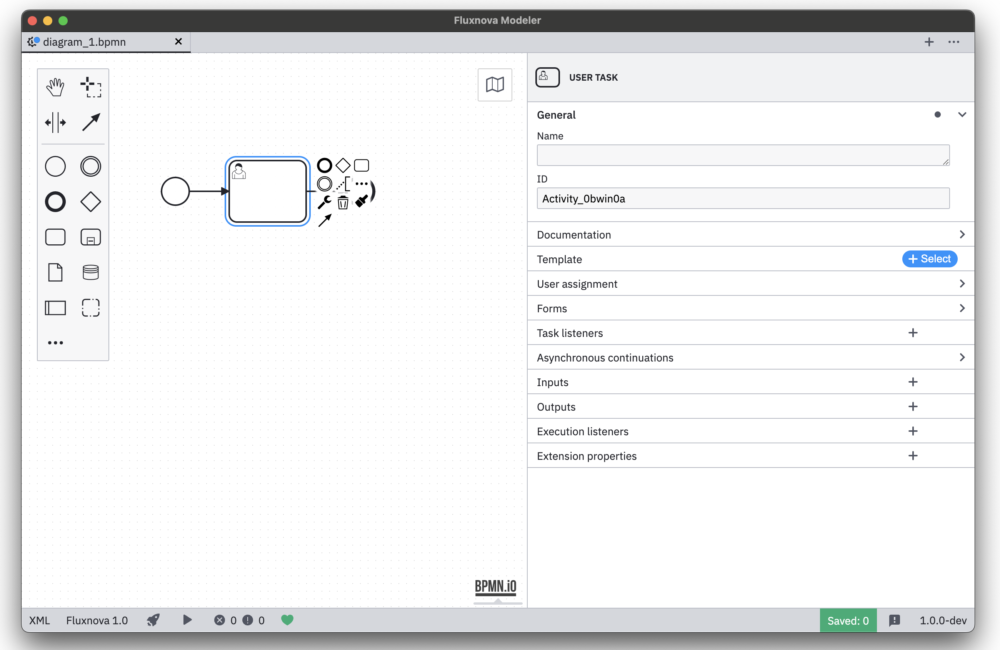

[](https://community.finos.org/docs/governance/Software-Projects/project-lifecycle)

# Fluxnova Modeler


[](https://github.com/finos/fluxnova-modeler/actions/workflows/CI.yml)

An integrated modeling solution for BPMN, DMN, and Forms based on [bpmn.io](http://bpmn.io).



## Resources

* [Changelog](./CHANGELOG.md)
* [Report a Bug](https://github.com/finos/fluxnova-modeler/issues)

## Building the Application

Build the app in a Posix environment. On Windows that is Git Bash or WSL. Make sure you have installed all the [necessary tools](https://github.com/nodejs/node-gyp#installation) to install and compile Node.js C++ addons.

```sh
# checkout a tag
git checkout main

# install dependencies
npm install

# build the application to ./dist
npm run build
```

### Development Setup


Spin up the application for development, all strings attached:

```sh
npm run dev
```

### Development Setup
Please checkout our [troubleshooting guide](./TROUBLESHOOTING.md) if you are experiencing issues when building from source.


## Contributing

Please checkout our [contributing guidelines](./CONTRIBUTING.md) if you plan to file an issue or pull request.

## License

Copyright 2025 FINOS

MIT

Uses [bpmn-js](https://github.com/bpmn-io/bpmn-js), [dmn-js](https://github.com/bpmn-io/dmn-js), [cmmn-js](https://github.com/bpmn-io/cmmn-js), and [form-js](https://github.com/bpmn-io/form-js) licensed under the [bpmn.io license](http://bpmn.io/license).

